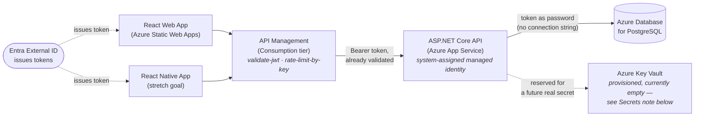

# PRD.md — Video Link Vault (Capstone)

*Drafted Sep 10 2026, revised Sep 11 2026 (Stripe/billing cut, access-control model added, legal/info pages added). Today's date and deadline both anchor this doc: work began Sep 10, full capstone due **Mon Oct 5 2026**. Supersedes the mini-project `PRD.md` this repo was seeded from — that document is preserved in git history and remains the accurate as-built record of the mini project itself; this one describes the target state of the capstone build. Where a capstone decision reopens or changes a mini-project decision, that's called out explicitly rather than silently overwritten — see `memory.md` for the full reasoning behind each one.*

## Purpose
A cloud-native, multi-user version of Video Link Vault: users sign in with their own account (no more hardcoded demo credentials), save/browse/filter/delete video links from TikTok, YouTube, Instagram, and Facebook, and organize them by category and free-form tags — same product as the mini project, now backed by a real database, real identity, and a real Azure deployment. Free accounts are capped at 30 links; an admin can grant specific accounts unlimited access or block an account entirely — no payment processing anywhere in the product. Built to demonstrate production Azure patterns (managed identity, Key Vault, API gateway, CI/CD) to recruiters, not just CRUD.

## Language, Framework, Version, App Type
- **Backend:** C#, .NET 10 (LTS), ASP.NET Core Web API (controller-based)
- **Frontend:** JavaScript/React 19 (Vite) + React Router, deployed to Azure Static Web Apps
- **Mobile (stretch):** React Native (Expo), separate codebase, same backend — target: free listing on the Apple App Store and Google Play, no in-app purchases
- **Database:** Azure Database for PostgreSQL – Flexible Server, **PostgreSQL 18** (Azure's current default for new servers, and what Timothy already has installed natively — checked Azure's PG18 extension-support gap versus 17 and it's limited to `ltree`/`isn`/`lo`, none of which this project touches). Local dev uses Timothy's existing native Postgres 18 install rather than a Docker container — local and deployed now match exactly, zero extra setup.
- **Identity:** Microsoft Entra External ID (external tenant)
- **App type:** Cloud-hosted web application (REST API + SPA client), single Azure region, with an optional mobile client

## Architecture (target state)

Every arrow into or out of the API is a managed-identity token, not a stored credential — that's the one thread running through the whole diagram.

**Identity — Microsoft Entra External ID, not roll-your-own.** Azure AD B2C has been closed to new customers since May 1, 2025, so it was never an option for a project starting now. Entra External ID is the direct replacement: a separate external tenant, self-service email signup, first 50,000 monthly active users free. This **replaces** the mini project's `AuthController`, `UserStore`'s credential role, `IPasswordHasher<User>`, and the `PasswordHash`/`LoginRequest`/`RegisterRequest` DTOs — those are removed, not extended. Identity for a request comes from a validated JWT's `oid` claim, not a session built on a hashed password.

A local `users` table is kept, but its job changes: it's a **profile row keyed by the Entra object ID** (email, display name, an `IsUnlimited` flag, an `IsBlocked` flag), not a credential store. The first authenticated request from an `oid` with no matching row creates one — just-in-time provisioning. `links.user_id` continues to point at this table's `Id`.

One direct, positive side effect: `{userId}` disappears from the API routes. `GET/POST /api/links`, `DELETE /api/links/{id}` — the owner comes from the validated token, not a route parameter a client could substitute. This closes the mini project's documented, accepted limitation ("any client that knows a GUID can read or delete that account's links").

**Database access — passwordless, via managed identity.** App Service gets a system-assigned managed identity. `Azure.Identity`'s `DefaultAzureCredential` requests a token for scope `https://ossrdbms-aad.database.windows.net/.default`; Npgsql's `UsePeriodicPasswordProvider` on the `NpgsqlDataSourceBuilder` uses that token as the connection password and handles refresh/caching automatically. There is no database password anywhere — not in `appsettings.json`, not in Key Vault, not in a GitHub secret. Local development keeps a real password (Timothy's native Postgres install); the code attaches the token provider only when the configured connection string has no password, so one codebase serves both environments without an `if (isProduction)` branch scattered through it. The Postgres side needs a database role created for the managed identity with the right grants — a manual, portal-driven step to do once, deliberately, not on deploy day.

**Secrets — Key Vault is provisioned, but honestly has nothing to hold right now, and that's stated plainly rather than papered over.** Key Vault's only assigned job in the previous draft of this PRD was the Stripe secret key and webhook signing secret — both gone now that billing is cut (see Deviations). Neither Entra External ID (the web app is a public SPA client using PKCE, and the API validates tokens against Entra's public signing keys) nor the passwordless Postgres connection needs a secret at all. Rather than inventing something to store just to justify the resource, Key Vault stays in the architecture **provisioned and wired into `Program.cs`'s configuration pipeline via managed identity, holding zero secrets today** — the pattern is real and demonstrable even though nothing sensitive exists yet. It becomes genuinely useful the moment a real one shows up (a future third-party API key, or billing if that's ever revisited). This is a defensible thing to say out loud in an interview — "provisioned passwordless-first, added a secret only once one existed" is a better answer than manufacturing one.

**Gateway — API Management (Consumption tier), not Front Door.** APIM is the single front door for both the web app and (eventually) the mobile app: `validate-jwt` verifies the Entra token's signature and issuer before a request ever reaches the API, and `rate-limit-by-key`/`quota-by-key` policies provide Layer-7 abuse protection. Consumption tier includes the first million operations/month at no fixed cost; the tradeoff is a multi-second cold start on the first request after idle, which needs a warm-up call before any live demo.

**Front Door — deliberately out of the MVP, considered and rejected for this shape, not just deferred.** Azure's infrastructure-level DDoS protection (Layer 3/4) is already on by default and free for every public IP, App Service and APIM included — no action needed. Azure's paid DDoS tiers (Network Protection, ~$2,944/mo; IP Protection, ~$199/mo per IP) attach to a standalone Public IP resource inside a VNet — a shape neither App Service nor APIM Consumption/Basic has without a networking change out of scope here, so they don't actually apply to this architecture regardless of cost. Front Door's real value on top of APIM would be Layer-7 flood mitigation and a managed WAF, but the managed rule sets and bot protection live in the Premium tier ($330/mo) — the free default protection plus APIM's own rate-limiting policy covers this project's actual risk profile at $0. **Front Door Standard is the one item explicitly cut on security-architecture grounds, not budget grounds** — it would be redundant in front of APIM for a single-region app with no real attacker profile. Revisit only if a real production traffic pattern ever justifies it.

**CI/CD — GitHub Actions with OIDC federated credentials**, not a stored publish profile or service-principal secret — the same no-plaintext-secrets posture as the database access, extended into the pipeline. EF Core migrations are generated as an idempotent SQL script in CI and applied as an explicit deploy step, not via `Database.Migrate()` at app startup — decouples "the app started" from "the schema changed" and is the habit worth building now. **Known gotcha, planned for in advance:** if the Postgres firewall is locked down, the GitHub-hosted runner's IP needs to be allowed (or a self-hosted runner used) for migrations to reach the database during deploy.

## Design of Custom Data Types (changes from the mini project)

**Models**
- `VideoLink` — unchanged shape (`Id`, `UserId`, `Url`, `Platform`, `Title`, `ThumbnailUrl`, `Category`, `Tags`, `CreatedAtUtc`), but now an EF Core entity. `Platform` requires `HasConversion<string>()` in the EF configuration or it persists as an `int` — unreadable rows, and a future enum reorder would silently corrupt existing data. `Tags` maps to Postgres `text[]` via Npgsql's native array support (decided over a join table — reopen only if tags ever need renaming/merging/their own counts).
- `User` — repurposed as a profile, not a credential holder. Drops `PasswordHash` entirely. Gains: `EntraObjectId` (the `oid` claim, unique, the real identity key), `IsUnlimited` (bool, default `false`, admin-granted — bypasses the free-tier cap), `IsBlocked` (bool, default `false`, admin-granted — see Access Control below). The existing hand-written `Email` property (private backing field, blank/format/immutability validation) is kept — it's still a good encapsulation example, and email still needs storing even though it no longer authenticates anything.
- **`VideoMetadataService`** (new) — `GetMetadataAsync(url)` switches on `DetectPlatform(url)`. Two real branches: **YouTube** (free, no network call — the existing `getYouTubeThumbnail()` ID-extraction logic moves server-side unchanged) and **TikTok** (oEmbed, open, no key required, the one platform where going server-side genuinely unlocks a thumbnail the client couldn't produce alone). Two fallback branches: **Instagram and Facebook always return a placeholder.** This is not a gap to close later — Meta's oEmbed responses stopped including `thumbnail_url` for Facebook posts/videos and Instagram posts effective Nov 3 2025 (verified directly against Meta's developer blog, logged in `memory.md`), and the replacement path requires a Meta developer app plus a `meta_oembed_read` token this project has no reason to obtain. `IHttpClientFactory` (never `new HttpClient()`), a ~3s timeout, and a try/catch that falls back to `null` — a missing thumbnail is a gray placeholder card, a failed HTTP call must never fail the save.

**Access Control (new — replaces the previously planned Stripe subscription entirely, see Deviations)**
- **No payment processing anywhere in this product.** Evaluated and deliberately cut: Stripe (web) and Apple/Google in-app purchase (mobile, which Stripe can't even substitute for — both platforms require their own billing system for a digital subscription consumed in-app) would each need their own integration, plus real revenue would trigger business registration, sales-tax questions, and insurance/auditing considerations entirely out of scope for a capstone. None of that exists in this design.
- **Free-tier cap: 30 links per account.** Enforced in exactly one place — `LinksController`'s `POST` handler checks the caller's current link count before inserting and returns `403` with a clear message if at the cap and `IsUnlimited` is `false`. `IsUnlimited` accounts are never capped.
- **`IsUnlimited` and `IsBlocked` are two independent flags, not one combined status.** An admin can lift the cap for an account (`IsUnlimited = true`) without touching whether it's blocked, and vice versa — deliberately modeled this way over a single enum so "blocked but would otherwise be unlimited" stays expressible even though it's an edge case today. `IsBlocked` is checked in a request pipeline filter (not per-controller) so a blocked account is rejected before it reaches any endpoint, not just the links ones.
- **There is no self-serve upgrade path.** Unlimited access is granted only by an admin, from the admin screen — matches the product's actual monetization model (none), and removes the need for anything resembling a checkout flow, confirmation email, or payment UI.

**Admin (new)**
- Modeled as an **Entra app role** (`Admin`) assigned in the External ID tenant, surfaced as a `roles` claim on the token and checked via `[Authorize(Roles = "Admin")]` — not a hand-rolled `IsAdmin` boolean on the `User` row, which would be one more piece of custom auth logic in a project that just finished removing custom auth logic.
- **Three concrete actions, not a stub:** list all users with their link count and current flags (`GET /api/admin/users`), grant or revoke unlimited access (`PATCH /api/admin/users/{id}/unlimited`), block or unblock an account (`PATCH /api/admin/users/{id}/block`). A blocked admin account is still possible to create accidentally — worth a guard (an admin can't block themselves) before this ships.

## Solution Structure (target)

Monorepo, cloned outside OneDrive (same reasoning as the mini project — background sync can corrupt `.git`). One new top-level project (`VideoLinkVault.Core`) shared between the API and, eventually, nothing on the frontend side (React/React Native don't reference a .NET class library — Core exists for the API and any future .NET client, not for code-sharing with JS):

    VideoLinkVault/
    ├── src/
    │   ├── VideoLinkVault.Core/                     shared class library — no DB, no web dependencies
    │   │   ├── Models/
    │   │   │   ├── Platform.cs                      unchanged from the mini project
    │   │   │   ├── VideoLink.cs                     unchanged shape, now an EF entity (mapped in Api/Data)
    │   │   │   └── User.cs                          REPURPOSED: drops PasswordHash, gains EntraObjectId/IsUnlimited/IsBlocked
    │   │   └── Interfaces/
    │   │       ├── IVideoLinkRepository.cs          NEW — the seam the mini project deliberately deferred (Deviation #4)
    │   │       └── IVideoMetadataService.cs         NEW
    │   │
    │   ├── VideoLinkVault.Api/                      ASP.NET Core Web API, EF Core + Npgsql — the only project with a DB connection
    │   │   ├── Data/
    │   │   │   ├── VideoLinkVaultDbContext.cs        NEW
    │   │   │   ├── Configurations/
    │   │   │   │   ├── VideoLinkConfiguration.cs     NEW — Platform.HasConversion<string>(), Tags as Postgres text[]
    │   │   │   │   └── UserConfiguration.cs          NEW — unique index on EntraObjectId
    │   │   │   └── Migrations/                       EF Core migrations; applied via CI as an idempotent SQL script, not Database.Migrate()
    │   │   │
    │   │   │       ↳ target database — NOT a folder in this repo, an external resource the connection string/managed identity point at:
    │   │   │           local dev  → Timothy's existing native Postgres 18 install (a dedicated `videolinkvault` database inside it, password auth, already in pgAdmin)
    │   │   │           deployed   → Azure Database for PostgreSQL – Flexible Server (B1ms, PostgreSQL 18), auth via App Service's managed identity — no password, no connection string secret anywhere
    │   │   ├── DTO/
    │   │   │   ├── CreateVideoLinkRequest.cs         unchanged from the mini project
    │   │   │   ├── UserResponse.cs                   unchanged shape — no password-adjacent fields ever existed to remove
    │   │   │   ├── AdminUserSummaryResponse.cs       NEW — id, email, link count, IsUnlimited, IsBlocked
    │   │   │   └── UpdateUserAccessRequest.cs        NEW — small body for the two PATCH endpoints below (e.g. { value: bool, reason?: string })
    │   │   ├── Middleware/
    │   │   │   └── BlockedUserFilter.cs              NEW — rejects any request from an IsBlocked account before it reaches a controller
    │   │   ├── Services/
    │   │   │   ├── EfVideoLinkRepository.cs          NEW — implements IVideoLinkRepository; replaces VideoLinkStore; enforces the 30-link cap on Add()
    │   │   │   └── VideoMetadataService.cs           NEW — implements IVideoMetadataService; YouTube + TikTok real, Meta placeholder
    │   │   ├── Controllers/
    │   │   │   ├── LinksController.cs                REPLACES VideoLinksController — {userId} removed, owner from token, 403 at cap
    │   │   │   └── AdminController.cs                NEW — GET /api/admin/users, PATCH .../unlimited, PATCH .../block, [Authorize(Roles = "Admin")]
    │   │   ├── appsettings.json                      Entra External ID authority/audience, Key Vault URI (provisioned, empty) — no secrets
    │   │   └── Program.cs                            DI, EF Core + managed-identity Npgsql provider, JWT bearer auth (Entra), Key Vault config source, CORS, BlockedUserFilter registration
    │   │
    │   │   ── REMOVED from the mini project's Backend_Link_Vault, not carried forward ──
    │   │       Controllers/AuthController.cs         · DTO/LoginRequest.cs · DTO/RegisterRequest.cs
    │   │       Services/UserStore.cs (credential role) · Services/VideoLinkStore.cs (superseded by EfVideoLinkRepository)
    │   │       IPasswordHasher<User> registration in Program.cs
    │   │
    │   │   ── NOT BUILT (evaluated and cut Sep 11 2026 — see Deviations) ──
    │   │       Controllers/BillingController.cs · Services/StripeService.cs · DTO/CheckoutRequest.cs · Stripe webhook endpoint
    │   │
    │   └── VideoLinkVault.Web/                      React 19 + Vite + react-router-dom (NEW dependency)
    │       └── src/
    │           ├── App.jsx                           now mostly routing + top-level auth/data providers; page content moves to pages/
    │           ├── router.jsx                        NEW — route table: / (vault), /about, /faq, /privacy, /terms
    │           ├── config.js                         API base URL (now the APIM gateway, not the API directly) + Entra External ID tenant/client IDs
    │           ├── auth/
    │           │   └── msalConfig.js                 NEW — MSAL instance, Entra External ID authority, token scopes
    │           ├── pages/                            NEW — each a real route, each with a co-located .css
    │           │   ├── VaultPage.jsx                 the existing header/sidebar/grid/footer app, moved here from App.jsx unchanged
    │           │   ├── AboutPage.jsx                 NEW — drafted content in this PRD's Legal & Informational Pages section
    │           │   ├── FaqPage.jsx                   NEW — drafted content in this PRD's Legal & Informational Pages section
    │           │   ├── PrivacyPolicyPage.jsx          NEW — drafted content in this PRD's Legal & Informational Pages section
    │           │   └── TermsOfServicePage.jsx        NEW — drafted content in this PRD's Legal & Informational Pages section
    │           └── components/                       each with a co-located .css, same convention as the mini project
    │               ├── LinkCard.jsx                  unchanged
    │               ├── CategorySidebar.jsx            unchanged
    │               ├── SearchBar.jsx                 unchanged
    │               ├── AddLinkDialog.jsx              loses client-side platform override as the primary source of truth once VideoMetadataService lands — becomes an optional override sent to the server, same relationship pattern the mini project already used for Title
    │               ├── SignInButton.jsx               NEW — replaces AuthDialog's mock-credential form with MSAL's redirect/popup sign-in
    │               ├── UsageBanner.jsx                NEW — replaces the earlier UpgradeDialog concept; shows "X/30 links used" and, at the cap, "contact an admin for unlimited access" — no checkout flow, because there's nothing to check out
    │               ├── AdminDashboard.jsx             NEW — admin-only, rendered only when the roles claim includes Admin; the three admin actions live here
    │               └── Footer.jsx                     NEW — extracted from App.jsx's inline footer; gains links to /about, /faq, /privacy, /terms alongside the existing saved/shown count
    │
    │           ── REMOVED from the mini project's Frontend_Link_Vault, not carried forward ──
    │               components/AuthDialog.jsx + .css   (MOCK_ACCOUNT hardcoded credential, client-side-only validation)
    │
    │           ── NOT BUILT (evaluated and cut Sep 11 2026) ──
    │               components/UpgradeDialog.jsx        (no checkout flow — replaced by UsageBanner.jsx above)
    │
    ├── mobile/ (stretch — not started until steps 1-6 are done)
    │   └── VideoLinkVault.Mobile/                    React Native (Expo), separate codebase, no shared frontend code with Web
    │       ├── App.js
    │       ├── auth/msalConfig.js                    MSAL React Native, same Entra External ID tenant as Web
    │       └── screens/
    │           ├── SignInScreen.js
    │           └── LinksListScreen.js                read-only for this deadline — no AddLink/Delete screens planned
    │
    └── .github/
        └── workflows/
            ├── build-and-test.yml                    dotnet build/test + npm build on every PR
            └── deploy.yml                            OIDC login to Azure, generate + apply idempotent EF migration script, deploy Api to App Service, deploy Web to Static Web Apps

**Endpoints (target)**

| Method | Route | Purpose | Auth |
|---|---|---|---|
| GET | `/api/links` | List the caller's links | Bearer token required |
| POST | `/api/links` | Add a link — `403` if at the 30-link cap and not `IsUnlimited` | Bearer token required |
| DELETE | `/api/links/{id}` | Delete a link | Bearer token required |
| GET | `/api/admin/users` | List all users + link counts + `IsUnlimited`/`IsBlocked` | Bearer token, `Admin` role |
| PATCH | `/api/admin/users/{id}/unlimited` | Grant or revoke unlimited access | Bearer token, `Admin` role |
| PATCH | `/api/admin/users/{id}/block` | Block or unblock an account | Bearer token, `Admin` role |

## Build Order (dependency-ordered, not date-boxed)

1. Solution restructure + EF Core against local Postgres 18; port existing CRUD; finally build the `IVideoLinkRepository`/EF-backed-repository seam the mini project deliberately deferred (PRD.md's mini-project Deviation #4).
2. Entra External ID: tenant provisioning, MSAL on the frontend, JWT validation on the API, JIT user provisioning, routes lose `{userId}`.
3. Azure deploy: App Service + Azure Postgres + managed-identity DB auth + Key Vault (provisioned, empty); GitHub Actions CI/CD via OIDC with idempotent-script migrations; APIM Consumption with `validate-jwt` + `rate-limit-by-key`. **A real, live, single-user-working deployment exists at the end of this step** — the checkpoint that matters most if nothing after it finishes in time.
4. `VideoMetadataService` — YouTube + TikTok server-side, Meta placeholders.
5. Access control — `IsUnlimited`/`IsBlocked` on `User`, the 30-link cap in `EfVideoLinkRepository`, `BlockedUserFilter`, the `Admin` app role, `AdminController`'s three endpoints, `AdminDashboard.jsx`, `UsageBanner.jsx`. Meaningfully smaller than the Stripe step it replaces — no external payment provider, no webhook, no test-mode considerations.
6. Legal & informational pages — `react-router-dom`, the four page components, `Footer.jsx`'s links. No backend dependency; sequenced here because the Privacy Policy's content assumes the data model (what's actually collected) is settled by this point.
7. React Native (Expo) read-only client — sign in, list links.
8. Front Door Standard — explicitly cut from MVP (see Architecture); only reconsidered if everything else lands early.

## External Resources Required
- Azure subscription: **MSSA/sponsored** (confirm the spending limit directly with the program if one exists; budgeting below assumes none is hit)
- Microsoft Entra External ID tenant (separate from the main Azure AD tenant)
- Azure Database for PostgreSQL – Flexible Server (Burstable B1ms or similar), PostgreSQL 18
- Local Postgres 18 (Timothy's existing native install, confirmed via `winget list PostgreSQL`) + pgAdmin 4 — no Docker required for dev
- Azure App Service (Linux, B1 or similar)
- Azure API Management (Consumption tier)
- Azure Key Vault (provisioned, currently empty — see Architecture)
- GitHub Actions (OIDC federated credential configured against the Azure subscription, no stored secrets)
- TikTok oEmbed (open, no key). YouTube thumbnail URL pattern (no API key, no account). Instagram/Facebook: **not obtained** — Meta developer app + `meta_oembed_read` deliberately out of scope (see VideoMetadataService above).
- **No Stripe account, no Apple Developer Program enrollment, no Google Play Developer account required for this deadline.** Apple/Google enrollment becomes relevant only if/when the React Native app is actually submitted for store listing, which is explicitly framed as "near future, if time allows" — not part of Oct 5 scope.

## Estimated Monthly Cost (lean stack, MSSA subscription)

| Resource | Approx. cost |
|---|---|
| App Service (B1) | ~$13 |
| Azure Postgres Flexible Server (B1ms + storage) | ~$15–20 |
| Static Web Apps | free tier |
| Entra External ID | free (< 50,000 MAU) |
| Key Vault | pennies (near-zero regardless of whether it holds a secret yet) |
| API Management (Consumption) | ~free at this volume |
| Front Door | $0 — cut from MVP |
| DDoS Network/IP Protection | $0 — doesn't apply to this architecture (see Architecture) |
| **Total** | **~$30–35/month** |

No change from the previous draft — Stripe in test mode was already free, so cutting it doesn't move this number. Check whether the MSSA subscription carries Azure-for-Students-style free credits for Postgres; if so this drops further. App Service and Postgres figures are estimates from public pricing guidance current as of Sep 2026 — verify against the Azure Pricing Calculator before committing.

## Legal & Informational Pages (drafted content)

*Drafted Sep 11 2026, accurate to this PRD's data model and architecture as of that date. **This is not legal advice** — it's a real, usable first draft for a student capstone project, written to be honest about what the app actually does and collects. Before any public launch, and especially before submitting to the Apple App Store or Google Play (both of which independently review privacy disclosures), have an actual lawyer or a service built for this — Termly, iubenda, or similar — review and finalize this language. Bracketed items are placeholders Timothy needs to fill in before publishing.*

### About (`/about`)

> **About Video Link Vault**
>
> Video Link Vault is a personal project built by Timothy Eckart as the capstone for the Microsoft Software & Systems Academy (MSSA) Cloud Application Development track. It exists to solve one small, real problem: video links saved from TikTok, YouTube, Instagram, and Facebook end up scattered across four different apps, with no easy way to browse, tag, or find them again later. Video Link Vault is one place to save them instead, with search, categories, and tags.
>
> This is an independent, non-commercial project. It is not affiliated with, endorsed by, or sponsored by TikTok, YouTube, Google, Instagram, Facebook, or Meta — it links to content on those platforms but doesn't host or control it.
>
> Questions, feedback, or an issue to report? [contact email — Timothy to add]

### FAQ (`/faq`)

> **Frequently Asked Questions**
>
> **Is Video Link Vault free?** Yes. Every account gets up to 30 saved links at no cost. There is no paid tier and no payment information is ever collected.
>
> **How do I get more than 30 links?** Unlimited access is granted individually by an admin — there's no self-serve upgrade or purchase. If you need more room, [contact email — Timothy to add].
>
> **Why don't Instagram and Facebook links show a real thumbnail?** As of November 2025, Meta (Instagram/Facebook's parent company) stopped including thumbnail images in the public data its platforms share with apps like this one. YouTube and TikTok links still get real thumbnails; Instagram and Facebook links show a placeholder image instead. This isn't something we can fix on our end.
>
> **Is my payment information stored anywhere?** No — Video Link Vault doesn't process payments at all, so there's nothing to store.
>
> **Can I delete my account and my data?** Yes — [contact email — Timothy to add] to request deletion. *(A self-service delete-my-account option is planned before any App Store/Play Store submission — see Known Limitations.)*
>
> **Is there a mobile app?** A companion mobile app is planned but not guaranteed for this project's current deadline. If it ships, it will be free with no in-app purchases.

### Privacy Policy (`/privacy`)

> **Privacy Policy**
> *Last updated: [date of first publish]*
>
> **What we collect.** When you sign in, Microsoft Entra External ID (our identity provider) shares your email address and display name with us. When you use the app, we store the video links you save, along with any title, category, and tags you give them. We do not collect payment information, because we don't process payments.
>
> **How we use it.** Your email and name identify your account and its saved links. Nothing you provide is sold, and nothing is used for advertising — this app doesn't run ads or third-party trackers.
>
> **Third parties involved.** Authentication runs through Microsoft Entra External ID. The app itself and its data run on Microsoft Azure, in [Azure region — TBD]. Thumbnail images for YouTube and TikTok links are requested directly from those platforms' own public endpoints when you save a link — no personal data is sent to them beyond the link's own URL.
>
> **How long we keep it.** Your data is kept as long as your account exists. You can request account and data deletion at any time by contacting [contact email — Timothy to add]; it will be deleted within [X days — Timothy to set a real number].
>
> **Children's privacy.** This app is not directed at, and is not knowingly used to collect data from, children under 13.
>
> **Changes to this policy.** If this policy changes, the "last updated" date above will change with it. Continued use of the app after a change means you accept the update.
>
> **Contact.** [contact email — Timothy to add]

### Terms of Service (`/terms`)

> **Terms of Service**
> *Last updated: [date of first publish]*
>
> **1. What this is.** Video Link Vault is an independent, non-commercial project built by Timothy Eckart. By creating an account, you agree to these terms.
>
> **2. Your account.** You're responsible for the account you create and for keeping your sign-in secure. Accounts are free; free accounts may save up to 30 links. An administrator may grant an individual account unlimited saved links, at their sole discretion, with no guarantee of eligibility or timeline.
>
> **3. What you save here.** Video Link Vault stores links, titles, categories, and tags that you provide — it does not host, re-host, or take ownership of any video content itself. You're responsible for only saving links you have the right to save, and content on the linked pages remains governed by the terms of whichever platform (TikTok, YouTube, Instagram, Facebook) it lives on.
>
> **4. Acceptable use.** Don't use this app to store or organize links to content that is illegal, that infringes someone else's rights, or that violates the terms of service of the platform it's hosted on.
>
> **5. Account actions.** An administrator may block an account that violates these terms, at their discretion. Blocking may be reversed at the administrator's discretion; it is not a guaranteed or automatic process.
>
> **6. No warranty.** This app is provided "as is," as a student capstone project, with no guarantee of uptime, data durability, or continued availability. Back up anything you can't afford to lose.
>
> **7. Limitation of liability.** To the fullest extent permitted by law, Timothy Eckart is not liable for any damages arising from your use of this app, including lost data.
>
> **8. Changes.** These terms may change as the project evolves; continued use after a change means you accept the update.
>
> **9. Contact.** [contact email — Timothy to add]

## Known Limitations (accepted, not defects, going into the capstone build)
- **Instagram and Facebook links never get a real thumbnail.** Placeholder cards only, permanently, for reasons outside this project's control (Meta's Nov 2025 oEmbed changes). Documented as an accepted limitation, not a TODO.
- **APIM Consumption has a cold-start penalty.** A demo must include a warm-up request before anything is shown live.
- **No payment processing exists anywhere in this product**, by deliberate design (see Deviations) — not a placeholder for "add billing later" without re-opening this decision explicitly.
- **There is no self-service account deletion yet.** The Privacy Policy and FAQ above point users to email-based deletion for now. Before any real Apple App Store submission this becomes a hard requirement (App Store Review Guideline 5.1.1(v): apps that support account creation must support in-app account deletion) — flagged now, not planned for Oct 5.
- **The legal/info page content above is a real first draft, not a placeholder, but it is not legal review.** Get it reviewed before treating it as final, especially before any App Store or Play Store submission.
- **React Native, if it ships at all, is read-only** (sign in + list). Add/delete on mobile is out of scope for this deadline.

## Deviations from the Mini Project (each deliberate, reasoning in `memory.md`)
1. **Auth is fully replaced, not extended.** Entra External ID replaces the mini project's hashed-password auth outright; `AuthController`/`UserStore`'s credential logic/`PasswordHash` DTOs are removed.
2. **`{userId}` leaves the routes.** Ownership now comes from the validated token, closing the mini project's accepted "anyone with a GUID can access that vault" limitation.
3. **A real relational database replaces in-memory storage**, per the plan since the original v3 design doc — not a new decision, just finally executed.
4. **The `IVideoLinkRepository` interface seam**, deliberately skipped in the mini project, gets built now that EF Core/Postgres makes it worth having.
5. **Video metadata generation moves server-side**, closing the "client can lie about platform/thumbnail" trust gap flagged since the mini project's VideoMetadataService discussion.
6. **Stripe subscription billing was planned, then evaluated and cut (Sep 11 2026).** A real subscription would have meant Stripe on web and a separate, mandatory Apple/Google in-app-purchase integration on mobile (Stripe can't be used for a mobile digital subscription at all — both platforms require their own billing system), plus the business-registration, sales-tax, and insurance questions that come with real revenue. Replaced with a **30-link free-tier cap and admin-granted unlimited access** — a permissions problem instead of a billing problem, and the only model compatible with the stated goal of a free Apple/Google Play listing with no in-app purchases.
7. **The product gains an admin role that can grant unlimited access or block an account** — two independent flags on `User`, not a combined status, checked via an Entra app role rather than a hand-rolled boolean.
8. **The product gains four real informational/legal pages** (About, FAQ, Privacy Policy, Terms of Service) via `react-router-dom`, added both because the app now genuinely collects personal data (email, name) and because a hosted Privacy Policy URL is a hard requirement for any future Apple/Google Play listing.

---
*This PRD reflects decisions made through Sep 11 2026. It will be revised if scope changes before Oct 5 — see `memory.md`'s running log for anything decided after this date.*
